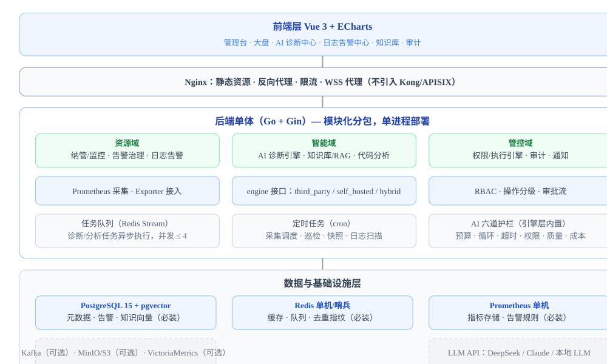
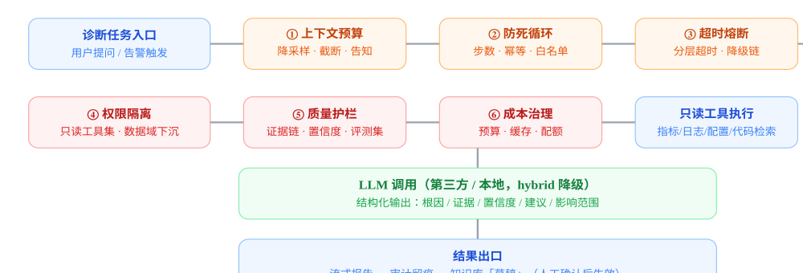

# 中间件智能问题解决平台 · 设计文档


版本 v1.0 · 2026-09-16 · 状态：评审通过，待排期评审


|          | 项目 | 内容 |
|------|------|
| 文档性质 | 研发可执行的技术设计文档（含产品判断与验收口径）                                                       |
| 版本历史 | v0.1 初稿 → v0.2（评审 21 页版）→ v1.0（本版：整合评审结论与优化项，收敛架构与范围，新增 AI 工程护栏） |
| 适用范围 | 研发 / 测试 / 运维 / 产品 / 安全评审                                                                   |
| 前置文档 | 《中间件智能问题解决平台_完整技术方案_更新版》（v0.2）及其评审意见                                     |

### 目录

1.  项目概述
2.  技术栈
3.  整体架构
4.  功能模块设计
5.  AI 能力工程护栏
6.  安全设计
7.  数据库设计
8.  接口设计
9.  项目结构
10. 非功能需求
11. 里程碑、验收与成功指标
12. 竞品与差异化
13. 风险与待确认
14. 架构与实现映射（实现现状注记）


## 一、项目概述

### 1.1 项目定位

中间件智能问题解决平台：一个**轻量级、AI 驱动的中间件问题诊断与解决平台**，覆盖 Redis、Kafka、RabbitMQ、MySQL、PostgreSQL、Elasticsearch 等常见中间件的统一纳管、监控、智能诊断与修复建议，并向上扩展到应用层服务器日志告警与 AI 代码分析。

平台不做通用监控平台（HertzBeat/Nightingale 赛道），不做重型企业级 AIOps 平台，聚焦「轻量 + AI + 问题解决闭环」，面向中小团队与个人开发者，可单机部署。

### 1.2 目标用户

| 角色       | 典型诉求                           | 平台提供                                                |
|------------|------------------------------------|---------------------------------------------------------|
| 运维工程师 | 批量部署、自动化巡检、快速排障     | 中间件纳管、统一监控、AI 根因分析、告警治理、日志告警   |
| 后端开发   | 自助查数、慢查询优化、定位应用问题 | 只读 SQL 查询、AI 自然语言查库、慢查询建议、AI 代码分析 |
| 技术负责人 | 全局视角、资源规划、操作可控       | 资源大盘、容量规划辅助、操作审计、权限管控              |

### 1.3 核心价值

- **统一入口：**告别多种工具切换，一站式管理中间件与告警；
- **安全管控：**全量操作留痕审计，高危操作二次确认与审批；
- **AI 赋能：**自然语言交互降低使用门槛，智能诊断提升排障效率；
- **事件驱动：**程序埋点/指标阈值触发 AI 分析，按需调用，节省 Token 成本；
- **灵活 AI 架构：**首选第三方 AI API（CodeBuddy / Claude Code / Codex），备选自研/本地 LLM，配置切换；
- **护栏优先：**AI 能力内置上下文预算、防死循环、超时降级、权限隔离、质量护栏、成本治理六道护栏，保证可用性与安全性。

### 1.4 设计原则

- **轻量优先：**模块化单体起步，不依赖 K8s，组件按需演进（见 3.3）；
- **事件驱动：**AI 只做「按需介入」，绝不用 AI 做持续轮询等苦力活；
- **AI 最小权限：**AI 能力只挂载只读工具集，执行权永远保留给人；
- **声明与实现一致：**能力矩阵逐项对应实现，未覆盖能力不对外承诺；
- **安全默认：**凭据最小权限、高危操作审批、审计可验证、代码出网受控。

## 二、技术栈

### 2.1 后端（Go）

| 层级       | 技术选型                     | 说明                                               |
|------------|------------------------------|----------------------------------------------------|
| Web 框架   | Gin                          | 高性能、轻量级，路由/中间件生态成熟                |
| ORM        | GORM                         | 支持 PostgreSQL，参数化查询防注入                  |
| 缓存/队列  | go-redis                     | 会话、去重指纹、Redis Stream 任务队列、AI 结果缓存 |
| 数据库驱动 | pgx + 各中间件官方 SDK       | PostgreSQL 与 Redis/Kafka/ES 等客户端              |
| 实时通信   | gorilla/websocket            | Web 终端、实时日志流；AI 流式输出走 SSE            |
| 任务调度   | robfig/cron                  | 定时采集、巡检、快照、日志扫描                     |
| 配置管理   | viper                        | YAML 配置 + 环境变量覆盖                           |
| 日志       | zap + lumberjack             | 结构化日志 + 日志轮转                              |
| 认证       | JWT（golang-jwt）            | Token 认证 + SameSite Cookie                       |
| 加密       | bcrypt + AES-256             | 密码哈希 + 敏感数据加密（密钥管理见 6.3）          |
| AI 引擎    | engine 包（http.Client）     | 统一引擎接口：third_party / self_hosted / hybrid   |
| 向量存储   | pgvector                     | 复用 PostgreSQL，不单独部署向量库                  |
| 指标客户端 | Prometheus client + Exporter | 采集走 Prometheus 生态，不自研采集器               |

### 2.2 前端（Vue 3）

| 层级      | 技术选型                           | 说明                       |
|-----------|------------------------------------|----------------------------|
| 框架      | Vue 3 + Composition API            | 组合式 API                 |
| 构建工具  | Vite                               | 开发体验与构建速度         |
| UI 组件库 | Element Plus                       | 管理后台风格               |
| 状态管理  | Pinia                              | 轻量状态管理               |
| 图表      | ECharts                            | 监控可视化、大盘           |
| Markdown  | markdown-it                        | 渲染 AI 诊断报告           |
| 流式输出  | EventSource / Fetch ReadableStream | AI 诊断流式返回（SSE）     |
| 终端      | xterm.js                           | Web 终端（通过 WebSocket） |

### 2.3 基础设施（必装 / 可选）

| 组件               | 选型                         | 定位                                               |
|--------------------|------------------------------|----------------------------------------------------|
| 平台数据库（必装） | PostgreSQL 15 + pgvector     | 元数据 + 告警事件 + 知识向量                       |
| 平台缓存（必装）   | Redis（单机/哨兵）           | 缓存 + 去重指纹 + 任务队列 + AI 结果缓存           |
| 指标存储（必装）   | Prometheus（单机）           | 指标存储与告警规则，查询走 PromQL                  |
| 反向代理（必装）   | Nginx                        | 静态资源 + 反向代理 + 限流 + WSS                   |
| 容器化（必装）     | Docker + Docker Compose      | 一键部署                                           |
| 消息队列（可选）   | Kafka                        | 日志量大或高并发接入时启用；默认 Redis Stream 替代 |
| 对象存储（可选）   | MinIO / S3                   | 诊断报告附件、审计快照；默认本地磁盘               |
| 时序扩展（可选）   | VictoriaMetrics              | 纳管规模增长后替换 Prometheus 单机                 |
| LLM API            | DeepSeek / Claude / 本地 LLM | 诊断推理；第三方代码分析引擎见 4.8.2               |

## 三、整体架构

### 3.1 架构理念

「传统监控兜底，事件驱动触发，AI 精准介入」：

- **日志报错触发（程序埋点）：**应用通过日志 Agent / HTTP Hook 推送 ERROR 级别异常与堆栈；
- **中间件异常触发（指标阈值）：**Prometheus 告警规则触达阈值时生成异常事件，再触发 AI 分析；
- **AI 不做苦力活：**持续读日志、扫库等由规则与采集管线完成，AI 仅在事件触发时介入；
- **AI 引擎可插拔：**统一 engine 接口，配置切换第三方 / 自研 / 混合，运行期可降级。

### 3.2 系统架构（模块化单体）





### 3.3 演进条件（避免提前拆服务）

- 纳管实例 \> 500 或出现独立团队多租户时，才按「诊断引擎 / 采集 / 通知」拆分微服务；
- 在此之前保持单进程 + 纵向扩容；Kafka、VictoriaMetrics、MinIO 仅在规模触发时启用；
- 所有演进通过配置开关与组件抽象实现，不依赖代码重构。

### 3.4 关键机制

- **事件驱动闭环：**触发（埋点/阈值）→ 去重收敛 → AI 介入 → 诊断 → 通知 → 知识沉淀，全程异步、可审计；
- **AI 引擎插拔：**`ai_engine.strategy` 支持 `third_party` / `self_hosted` / `hybrid`，hybrid 下第三方失败自动降级本地；
- **任务队列：**所有 AI 诊断与分析任务入 Redis Stream，单实例并发 ≤ 4，防止打爆外部 API 配额；
- **数据流闭环（问题解决）：**见下图示意。


## 四、功能模块设计

### 4.1 中间件纳管模块

**功能：**中间件注册（手动/自动发现）、分组管理（按环境 dev/staging/prod 与业务线）、连接测试、健康检查（定时探测 up/down）。

**能力矩阵（覆盖声明与实现一一对应）：**

| 中间件                                             | 纳管 | 监控指标 | 阈值告警 | AI 诊断 | 备注           |
|----------------------------------------------------|------|----------|----------|---------|----------------|
| Redis / MySQL / PostgreSQL / Kafka / Elasticsearch | ✓    | ✓        | ✓        | ✓       | 一期核心 5 种  |
| Nginx                                              | ✓    | ✓        | ✓        | —       | 仅基础监控     |
| RabbitMQ                                           | ✓    | 二       | 二       | 二      | 二期           |
| MongoDB / RocketMQ / Tomcat                        | —    | —        | —        | —       | 规划中，不承诺 |

**关键接口：**

```text
GET    /api/middlewares                # 中间件列表
POST   /api/middlewares                # 新增中间件
GET    /api/middlewares/:id            # 详情
PUT    /api/middlewares/:id            # 更新
DELETE /api/middlewares/:id            # 删除（L1，prod 需审批）
POST   /api/middlewares/:id/test       # 连接测试
POST   /api/middlewares/:id/health     # 健康检查（触发即时探测）
```

### 4.2 统一监控模块

**设计：**指标统一由 Prometheus + 官方 Exporter 采集，平台通过 PromQL 查询，**不建自有指标表**（v0.2 的 metric_snapshots 表已废弃）。历史趋势由 Prometheus 保留策略控制（默认 15 天，可配置）。

| 中间件        | 核心指标                                                           |
|---------------|--------------------------------------------------------------------|
| Redis         | 内存使用率、连接数、QPS、命中率、key 数量、慢查询数                |
| Kafka         | Broker 状态、Topic 分区数、消费者组 Lag、生产/消费速率、ISR 副本数 |
| MySQL         | QPS/TPS、连接数、慢查询数、缓冲池命中率、主从延迟                  |
| PostgreSQL    | QPS/TPS、连接数、慢查询数、缓存命中率、锁等待                      |
| Elasticsearch | 集群健康状态、节点数、索引数量、搜索/索引速率、JVM 堆使用率        |
| Nginx         | 活跃连接数、请求速率、错误率、响应时间                             |

**关键接口：**

```text
GET /api/metrics/:id             # 当前指标（PromQL 查询）
GET /api/metrics/:id/history     # 历史趋势
GET /api/metrics/compare         # 多实例对比
```

### 4.3 AI 诊断中心（核心差异化）

**功能：**自然语言提问（如「Redis 最近为什么变慢了」）→ 平台自动采集相关实例的实时指标/日志/配置 → 组装上下文 → LLM 根因分析 → 修复建议 → 流式返回；诊断历史自动存档、可检索复用。

**流程：**用户提问 → 识别目标中间件（规则+实体匹配）→ 按 5.2 上下文预算采集数据 → 一次 LLM 调用 → 流式输出结构化报告 → 结果按 5.7 缓存。

**关键接口：**

```text
POST /api/ai/diagnose            # AI 诊断（SSE 流式）
POST /api/ai/diagnose/sync        # AI 诊断（同步）
GET  /api/ai/diagnosis-history    # 诊断历史
GET  /api/ai/diagnosis/:id        # 诊断详情
```


**产品约束：**诊断输出必须结构化（根因/证据/置信度/建议/影响/待确认），无证据结论标注「推测」；向量相似命中仅作「参考案例」，不作为最终诊断（见 5.7）。


### 4.4 告警治理模块

**功能：**阈值告警（warning/critical 多级）、AI 告警降噪、多渠道通知、告警收敛与升级。

**收敛分级（v0.2 优化）：**

- **规则级（实时，主链路）：**错误指纹 + 时间窗口去重（N 分钟同指纹合并为 1 条）+ 冷却期（M 分钟内静默）；
- **语义聚类（离线，辅助）：**告警向量嵌入 → 相似度聚类，每 5 分钟批处理，**仅合并展示、不修改告警状态**，误合并可撤销；
- **因果收敛（二期）：**「数据库挂了 → API 全挂 → 网关 502」依赖服务拓扑数据，一期不做。

**通知渠道：**飞书 / 企业微信（Webhook + 消息卡片）、钉钉（备选）、邮件（低优先级）。卡片支持「确认 / 驳回 / 查看详情」，**不支持一键执行**（见 6.2）。

**关键接口：**

```text
GET    /api/alerts/rules            # 告警规则列表
POST   /api/alerts/rules            # 创建规则
PUT    /api/alerts/rules/:id        # 更新规则
DELETE /api/alerts/rules/:id        # 删除规则
GET    /api/alerts/history          # 告警历史
POST   /api/alerts/:id/ack          # 确认告警
POST   /api/alerts/cluster          # 告警聚类分析（AI，离线）
```

### 4.5 知识库模块

**功能：**诊断结果自动归档、运维手动录入、pgvector 向量检索、诊断时推荐相似案例。

**质量闭环（v0.2 优化）：**AI 诊断结果自动沉淀为**「草稿」状态**，人工确认（采纳/纠错/废弃）后转为正式条目并参与检索；知识条目支持采纳率统计，低采纳率条目降权。

**关键接口：**

```text
GET    /api/knowledge              # 列表
POST   /api/knowledge              # 新增条目
GET    /api/knowledge/search       # 智能检索（向量）
GET    /api/knowledge/:id          # 详情
PUT    /api/knowledge/:id          # 更新（草稿→正式）
DELETE /api/knowledge/:id          # 删除（L1）
```

### 4.6 修复建议与执行模块

**功能：**AI 生成修复建议 → 修复预览（影响范围/风险）→ 分级执行 → 执行审计。

**操作分级（安全核心）：**

| 级别    | 操作类型                                             | 执行要求                                                                    |
|---------|------------------------------------------------------|-----------------------------------------------------------------------------|
| L0 只读 | 查询、诊断、修复预览                                 | 直接执行                                                                    |
| L1 低危 | 确认告警、知识库编辑、创建告警规则                   | 直接执行，留痕                                                              |
| L2 高危 | 清理 Redis key、重启服务、删数据、改配置、SQL 写操作 | 二次确认 + 审批（prod 强制审批，审批超时 30min 自动拒绝），执行结果回填复核 |

**关键接口：**

```text
POST /api/fix/preview            # 预览修复操作（L0）
POST /api/fix/execute            # 执行修复（L1/L2，L2 走审批流）
GET  /api/fix/history            # 修复历史
```

### 4.7 审计日志模块

**功能：**全量记录「谁、何时、对哪个中间件、执行了什么操作、结果如何」；支持按用户/中间件/时间/操作类型检索。

**可验证性（v0.2 修订）：**承诺为「**只追加 + 删除需双人复核**」；audit_logs 不提供 UPDATE/DELETE API，每日生成哈希链快照（落盘/对象存储）并周期校验（实现见 6.4）。

**关键接口：**

```text
GET /api/audit/logs            # 审计日志列表（admin/运维）
GET /api/audit/logs/:id        # 日志详情
```

### 4.8 日志告警与 AI 代码分析

#### 4.8.1 采集层

| 采集方式         | 适用场景                 | 说明                                                              |
|------------------|--------------------------|-------------------------------------------------------------------|
| Agent 采集       | 生产环境（默认）         | 轻量 Go Agent 部署在服务器，tail 日志增量读取，记录偏移量避免重复 |
| HTTP Hook        | 应用主动上报             | 应用 POST ERROR 日志到平台，零侵入                                |
| Filebeat/Fluentd | 已有 ELK/Loki            | 复用现有日志基础设施，AI 层叠加                                   |
| Kafka 消费       | 高并发（可选组件启用时） | 日志先入 Kafka 削峰，分析服务消费                                 |

**采集内容：**ERROR 日志、GC 日志（Full GC/STW）、异常堆栈、错误上下文（前后 N 行）。

#### 4.8.2 去重聚合层

- **错误指纹：**异常类名 + 错误消息模板（去变量），例如 `NullPointerException at OrderService.process()`；
- **窗口去重：**5 分钟内同指纹合并为 1 条；**冷却期：**告警发送后 M 分钟内静默；
- **语义聚类：**502/503/upstream timeout 等本质相同的告警合并（离线，见 4.4）；
- **实现：**Redis 存指纹与最后发送时间；pgvector 做语义向量。

#### 4.8.3 AI 代码分析（v0.2 修订：一期收敛）

| 方案                                     | 说明                                                                 | 一期范围                                     |
|------------------------------------------|----------------------------------------------------------------------|----------------------------------------------|
| 首选：第三方 AI API                      | 将堆栈 + 仓库信息 + 监控上下文发送至 CodeBuddy / Claude Code / Codex | ✓ 一期，需满足 6.5 出网合规（白名单 + 脱敏） |
| 备选：本地检索 + LLM                     | 堆栈定位文件行 → 上下文切片 → 本地/内网 LLM 诊断                     | ✓ 一期（简单检索），合规场景兜底             |
| 自研三层索引（AST+知识图谱+向量+Rerank） | 类 GitHub Code Search 重型方案                                       | 二期/规划，按需求评估，一期不投入            |

**推送模板（三点式，500 字内）：**\[问题位置\] 服务/文件/方法 → \[根因分析\]（含去重次数）→ \[应急方案\]（临时/短期/长期）→ \[影响范围\]。

## 五、AI 能力工程护栏

AI 相关能力内置六道工程护栏，全部在 engine 层实现，与业务代码解耦。管线见下图：





### 5.1 能力边界：一期不做自主循环 Agent

AI 诊断中心定位为「**单轮诊断 + 工具预采集**」：用户提问 → 平台按固定管线采集上下文 → 一次 LLM 调用产出结论，不迭代、不自主决策、不调用执行类工具。自主排障 Agent 列为二期探索项，且必须满足 5.2-5.6 全部护栏才能放量。


#### 5.2 上下文预算（防上下文过大）

- 单次诊断输入预算 **8K tokens**、输出 2K（可配置）；超预算截断并**告知用户截断的维度**；
- 时序指标 → 降采样摘要（均值/P95/趋势斜率/拐点 + 异常片段），不塞原始序列；
- 日志：错误前后 20 行 × 最多 5 个来源；代码：Top-5 文件 × ≤200 行；
- 固定 Prompt 模板（System/问题/上下文/输出约束），便于评测与复现。


#### 5.3 防死循环 / 任务失控

- 二期 Agent 上限：最大 8 步、总时长 ≤5min、任务 token 上限；
- 循环检测：同工具 + 同参数状态指纹重复 2 次即终止；
- 工具白名单 + 决策卡（每步说明「为什么需要该工具」）；
- 达到上限 → 停止并输出「已中止 + 中间结论 + 建议人工介入」；
- LLM 失败可重试 2 次（指数退避）；**工具调用失败不自动重试**，记录原因。


#### 5.4 超时与降级链

- LLM 调用：连接 5s / 首字节 15s / 总时长 60s，流式输出超时重置；
- 工具调用 10s 超时，超时放弃该数据源，继续用已有上下文并标注缺失维度；
- 整任务 DAG 超时 2min；
- 降级链：第三方连续失败 2 次 / P95 超阈值 → 本地 LLM → 规则引擎 + 知识库检索（输出「半自动结论 + AI 不可用提示」）。


#### 5.5 权限隔离（防权限溢出）

- AI 只挂载**只读工具集**（指标/日志/配置/代码检索），永无执行权；
- 工具层强制按**发起人数据权限**过滤实例与环境，不依赖 Prompt 约束；
- AI 生成 SQL：规则校验（只读、强制 LIMIT 100、禁止多语句/表白名单）后才执行；
- AI 每次工具调用独立审计（看了哪些实例/文件），可关联发起人。


#### 5.6 质量护栏（防幻觉）

- 输出强制结构化：根因 / 证据引用 / 置信度 / 建议 / 影响 / 待确认项；
- 每条结论必须引用证据（指标名/日志行/代码位置），无证据标注「推测」；
- 内置 **20-50 条典型故障评测集**（按中间件类型），引擎/模型切换后回归；
- 用户「有用/没用」反馈 + 采纳率统计，作为质量基线。


#### 5.7 成本治理

- 确定性缓存：同实例 + 同问题签名 + 24h 直接返回（不耗 token）；
- 向量相似命中降级为「参考案例」展示，不作为最终诊断（避免 I2 误导风险）；
- 按次 + 按日预算（用户/团队维度），接近上限告警；并发 ≤ 4 防打爆配额；
- API key 配额监控：剩余量 / 日消耗，异常突增自动熔断。


## 六、安全设计

### 6.1 RBAC 权限模型

| 角色   | 权限                                      |
|--------|-------------------------------------------|
| 管理员 | 全部权限 + 用户管理 + 审批管理 + 审计查看 |
| 运维   | 纳管、告警、执行 L1/L2、审计只读          |
| 开发   | SQL 只读查询、AI 诊断、知识库建议         |
| 只读   | 大盘、诊断报告查看                        |

**数据权限：**按环境（dev/staging/prod）与分组隔离，权限点独立配置；权限校验在服务端工具层强制执行。

### 6.2 操作分级与执行链路

- 操作分 L0/L1/L2（定义见 4.6）；L2 高危操作执行链路：**预演（影响预览）→ 审批（prod 强制，超时 30min 自动拒绝）→ 执行 → 结果回填复核**；
- **IM 卡片边界：**只做通知 + 确认/驳回 + 查看详情，不做一键执行；执行统一回 Web 端（可叠加二次确认），避免 IM 上下文身份不可信；
- SQL 查询：强制只读账号 + 强制 LIMIT（默认 100，上限 1000）+ 敏感列脱敏 + 独立审计；写操作一律走执行工单（L2）。

### 6.3 凭据与密钥管理

- 主密钥：独立密钥文件（0600 权限）+ 环境变量注入，90 天轮换，可选接 KMS；
- 被管中间件：使用**最小权限账号**（监控只读账号）；SSH 用密钥 + 跳板机，不存明文密码；
- AI key / Git 凭据：加密存储，独立轮换；密钥泄露应急与轮换流程随 M1 落地。

### 6.4 审计可验证

- audit_logs 只追加（不提供 UPDATE/DELETE API），删除需双人复核；
- 每日生成审计哈希链快照（落盘/对象存储）+ 周期校验，异常篡改可检出；
- 覆盖范围：登录、增删改、SQL 查询、修复执行、AI 工具调用、审批动作。

### 6.5 出网合规（代码 / 堆栈）

- 服务级**出网白名单**：默认关闭，按仓库/服务维度开启「允许第三方 AI 分析」；
- 出网内容脱敏：堆栈去 IP/用户名/手机号/请求 ID；代码片段 ≤200 行/文件；可配置敏感词过滤；
- 全量代码发送需管理员审批；合规模式（金融/政务）走本地 LLM + 简单检索（5.4 降级链承接）。

### 6.6 传输与存储安全

| 维度     | 措施                                                   |
|----------|--------------------------------------------------------|
| 密码存储 | bcrypt 加盐哈希                                        |
| 敏感数据 | 连接密码等 AES-256 加密存储（密钥见 6.3）              |
| 传输加密 | 全站 HTTPS，WebSocket 使用 WSS                         |
| 注入防护 | GORM 参数化查询；AI 生成 SQL 过规则校验（5.5）         |
| XSS/CSRF | 前端输入过滤 + CSP；JWT + SameSite Cookie              |
| 高危操作 | DROP/TRUNCATE/DELETE 无 WHERE 等二次确认 + 审批（6.2） |

## 七、数据库设计

**总则：**指标数据存 Prometheus（见 4.2），**不设 metric_snapshots 表**（v0.2 已废弃）；PostgreSQL 只存元数据、告警、诊断、知识、审计。

### 7.1 核心表结构

#### 中间件实例表 middleware_instances

| 字段                          | 类型                   | 约束          | 说明                                   |
|-------------------------------|------------------------|---------------|----------------------------------------|
| id                            | BIGSERIAL              | PK            |                                        |
| name                          | VARCHAR(128)           | NOT NULL      | 实例名称                               |
| mw_type                       | VARCHAR(16)            | NOT NULL      | redis/kafka/rabbitmq/mysql/pg/es/nginx |
| host / port                   | VARCHAR(255) / INTEGER | NOT NULL      | 连接地址                               |
| username / password_encrypted | VARCHAR(128) / TEXT    |               | AES-256 加密（密钥见 6.3）             |
| environment                   | VARCHAR(16)            | DEFAULT 'dev' | dev/staging/prod                       |
| group_name / tags             | VARCHAR(64) / JSONB    |               | 分组与标签                             |
| status                        | SMALLINT               | DEFAULT 1     | 1-在线 0-离线                          |
| config                        | JSONB                  |               | 连接配置扩展字段                       |

#### AI 诊断记录表 ai_diagnoses（v0.2 增字段）

> **实现注记（INC-019）**：GORM 命名策略会把常见缩写先改写再切词，`AIDiagnosis` 在数据库里的
> **真实表名是 `a_idiagnoses`**。手写 SQL / DDL 时若按本节的标题写 `ai_diagnoses`，会报
> SQLSTATE 42P01；实现里一律用 `model.TableNameOf` 推导表名。

| 字段                  | 类型        | 说明                                     |
|-----------------------|-------------|------------------------------------------|
| id                    | BIGSERIAL   | PK                                       |
| user_id / instance_id | BIGINT      | FK → users / middleware_instances        |
| user_query            | TEXT        | 用户提问                                 |
| collected_metrics     | JSONB       | 采集的指标摘要                           |
| diagnosis_result      | TEXT        | 结构化诊断结果                           |
| suggestions           | JSONB       | 修复建议列表                             |
| feedback              | VARCHAR(16) | 新增：useful/useless/adopted（质量闭环） |
| engine_status         | VARCHAR(32) | 新增：ok/degraded/fallback（记录降级）   |
| cost_tokens           | INTEGER     | Token 消耗                               |
| engine_used           | VARCHAR(32) | third_party/self_hosted                  |

#### 告警相关表（alerts / alert_rules / alert_embeddings）

| 表               | 关键字段                                                                                                          | 说明                                  |
|------------------|-------------------------------------------------------------------------------------------------------------------|---------------------------------------|
| alerts           | instance_id, rule_id, alert_level, alert_message, status(active/acknowledged/resolved), triggered_at, resolved_at | 中间件阈值告警（v0.2 明确职责）       |
| alert_rules      | instance_id, metric_name, operator, threshold, level, window, notify_channels                                     | 新增：告警规则（v0.2 只有外键引用）   |
| alert_embeddings | alert_id, alert_content, embedding vector(768), clustered                                                         | 告警向量（pgvector HNSW），离线聚类用 |

#### 知识库表 knowledge_base

> **实现注记（INC-019）**：真实表名是 **`knowledge_bases`**（GORM 复数化），不是本节标题里的
> `knowledge_base`；实现里同样用 `model.TableNameOf` 推导。

| 字段                     | 类型                 | 说明                                         |
|--------------------------|----------------------|----------------------------------------------|
| id, title, content       | —                    | 条目主体                                     |
| mw_type / tags           | VARCHAR(16) / JSONB  | 关联中间件与标签                             |
| source                   | VARCHAR(16)          | manual/auto（auto 为诊断沉淀草稿）           |
| status                   | VARCHAR(16)          | 新增：draft/published/deprecated（质量闭环） |
| adopt_count / feedback   | INTEGER / JSONB      | 新增：采纳统计与反馈                         |
| diagnosis_id / embedding | BIGINT / vector(768) | 来源诊断 / 向量                              |

#### 审计日志表 audit_logs（只追加）

| 字段                               | 类型                              | 说明                         |
|------------------------------------|-----------------------------------|------------------------------|
| id, user_id, instance_id           | —                                 | 操作者与对象                 |
| action_type, action_detail, result | VARCHAR(32) / JSONB / VARCHAR(16) | 操作类型/详情/结果           |
| ip_address, created_at             | VARCHAR(45) / TIMESTAMPTZ         | 来源与时间                   |
| hash_prev, hash_self               | VARCHAR(64)                       | 新增：哈希链（每日快照校验） |

#### 日志告警域（server_instances / log_alert_events / ai_analysis_tasks / ai_code_analyses / notification_logs）

> 实现现状注记：平台不持有代码仓库映射与本地代码缓存，无 `code_repos` 表；仓库定位由外部 AI 分析服务负责。

| 表                | 关键字段                                                                                                                                                             | 说明                                   |
|-------------------|----------------------------------------------------------------------------------------------------------------------------------------------------------------------|----------------------------------------|
| server_instances  | name, ip, hostname, environment, group_name, status                                                                                                                  | 服务器实例                             |
| log_alert_events  | event_id, server_id, service_name, alert_type, error_signature, raw_stacktrace, error_count, first_seen_at, last_seen_at, analysis_state(pending/running/awaiting/done/failed/disabled), suppressed, cooldown_until | 应用日志告警事件（与 alerts 职责分离） |
| ai_analysis_tasks | event_id, task_id, run_id, protocol, state(pending/running/awaiting/done/failed/disabled), analysis_error                                                            | 提交给外部 AI 分析服务的异步任务       |
| ai_code_analyses  | event_id, located_file, located_line, code_snippet, root_cause, emergency_plan, fix_suggestion, impact_scope, confidence, cost_tokens, engine_used, repo_revision    | 代码分析报告（结论由外部服务返回）     |
| notification_logs | event_id, channel, target, content, status, sent_at                                                                                                                  | 通知记录                               |

### 7.2 索引设计

```text
-- 告警（中间件域）
CREATE INDEX idx_alert_instance_time ON alerts(instance_id, triggered_at DESC);
-- 告警向量（pgvector HNSW）
CREATE INDEX idx_alert_embedding ON alert_embeddings USING hnsw (embedding vector_cosine_ops);
-- 知识库向量
CREATE INDEX idx_knowledge_embedding ON knowledge_base USING hnsw (embedding vector_cosine_ops);
-- AI 诊断
CREATE INDEX idx_diagnosis_instance ON ai_diagnoses(instance_id, created_at DESC);
-- 审计（只追加，按时间倒序检索）
CREATE INDEX idx_audit_user_time ON audit_logs(user_id, created_at DESC);
CREATE INDEX idx_audit_instance ON audit_logs(instance_id, created_at DESC);
-- 日志告警（应用域）
CREATE INDEX idx_log_event_sig ON log_alert_events(error_signature, last_seen_at DESC);
CREATE INDEX idx_log_event_srv ON log_alert_events(server_id, last_seen_at DESC);
```

## 八、接口设计

### 8.1 通用约定

- 认证：`Authorization: Bearer <JWT>`；限流：按用户/实例维度（Nginx + 应用层双限流）；
- 统一响应：`{code, message, data}`；分页：`page/page_size`（默认 20，上限 100）；
- 错误码分段：40x 业务（400x 参数、401x 认证、403x 权限、404x 不存在）、50x 系统；
- 流式接口：AI 诊断走 SSE（`text/event-stream`），事件类型 `meta/data/done/error`；
- 权限标注：接口文档标注所需权限点与操作级别（L0/L1/L2），L2 接口由审批服务拦截。

### 8.2 接口总览

| 模块     | 接口                                                                                             | 级别                       |
|----------|--------------------------------------------------------------------------------------------------|----------------------------|
| 纳管     | GET/POST /api/middlewares · GET/PUT/DELETE /api/middlewares/:id · test · health                  | 读写 L1，删除 prod L2      |
| 监控     | GET /api/metrics/:id · /history · /compare                                                       | L0                         |
| AI 诊断  | POST /api/ai/diagnose（SSE）· /sync · GET diagnosis-history · diagnosis/:id                      | L0                         |
| 告警     | CRUD /api/alerts/rules · GET history · POST :id/ack · POST cluster                               | 规则 L1，ack L1            |
| 知识库   | CRUD /api/knowledge · GET search                                                                 | 写 L1                      |
| 修复执行 | POST /api/fix/preview · execute · GET history                                                    | preview L0 / execute L1-L2 |
| 审计     | GET /api/audit/logs · /:id                                                                       | 管理员/运维                |
| 日志告警 | GET /api/log-alerts/events · GET /api/log-alerts/analysis · POST /api/ai/code-analyze            | L0/L1                      |
| 系统     | GET /api/system/overview（大盘）· GET /api/users · GET /api/roles · 审批 GET/POST /api/approvals | 按角色                     |

## 九、项目结构

> 以下为当前代码库的实际结构（实现现状注记，随代码演进更新；设计正文第三~八章描述的是职责划分，包名以此节为准）。

### 9.1 后端（middleware-ops/，模块化单体）

```text
cmd/
  server/main.go              # 服务入口（单进程装配）
  renderdump/main.go          # 集成渲染产物的本地调试工具
internal/
  apperr/                     # 业务错误码与错误类型
  config/                     # 配置（viper，ai_engine 策略、AI 分析服务设置）
  model/                      # 数据模型（含 feedback/hash 字段、日志告警、AI 分析任务）
  repository/                 # 数据访问层（审计表仅追加）
  service/                    # 业务逻辑（resource / ai / control 三域，同包按文件划分）
    scheduler.go              # 定时任务（日志告警后处理等）
    codeanalysis.go           # AI 代码分析：提交外部 AI 服务 + 收回调/轮询结论
    ai_analysis_client.go     # 外部 AI 分析服务客户端
    logalert.go · logalertrule.go · logalert_worker.go
    logpipeline.go            # Kafka 日志消费编排
    ai/                       # 诊断 Prompt 与上下文束（bundle/prompt）
  engine/                     # AI 引擎抽象（核心）
    engine.go                 # 引擎接口定义
    factory.go                # 引擎工厂（配置创建）
    http_provider.go · hybrid.go · rule_engine.go
    guardrail/                # 六道护栏实现
      budget.go               # ① 上下文预算
      loop_guard.go           # ② 防死循环
      timeout.go              # ③ 超时熔断
      permscope.go            # ④ 权限隔离
      quality.go              # ⑤ 质量护栏（结构/评测）
      cost.go                 # ⑥ 成本治理
  monitor/                    # Prometheus 集成（查询封装，无自有采集器）
  logpipe/                    # Filebeat/Kafka 事件解析与映射
  integration/                # 集成中心：Ansible/Filebeat 渲染、模板、校验
  handler/                    # HTTP 处理器（参数绑定、权限点声明、统一响应）
  router/                     # 路由表（权限点 + 操作级别显式声明）
  middleware/                 # 追踪/恢复/限流/认证/数据权限
  db/                         # 数据库连接与迁移（pgvector 适配）
  docker/ · pkg/cache/ · response/ · logger/ · utils/
```

> 说明：日志采集在被管侧由 Filebeat 自洽运行，平台侧没有独立采集器包；通知（feishu/wecom/dingtalk/email + 卡片）由 `service/notifier.go` 承载；定时任务集中在 `service/scheduler.go`。平台**不 clone、不缓存任何业务代码仓库**，AI 代码分析通过外部 AI 分析服务完成（见第十四章）。

### 9.2 前端（middleware-ops-web/，Vue 3）

```text
src/
  api/                        # 接口封装（http 客户端 + 资源 API + 类型定义）
  components/                 # StatCard / MetricChart / DiagnosisReport / LevelTag / EmptyGuide ...
  composables/                # useListPage / useViewport（列表页与响应式复用逻辑）
  layouts/                    # AppShell / SideNav（含移动端抽屉导航）
  router/ · stores/ · styles/ # 路由、Pinia、主题令牌（CSS 变量）
  views/
    Dashboard.vue             # 全局大盘
    Middleware/ Monitor/      # 纳管、监控
    Integration/              # 集成中心（Exporter/Filebeat 接入）
    AICenter/                 # AI 诊断中心（Diagnose/History/Quality）
    Alert/ LogAlert/          # 指标告警、日志告警（事件/规则）
    Knowledge/ Fix/ Audit/    # 知识库、修复执行、审计
    System/                   # 系统设置（用户/审批/通知渠道/AI 设置/安全）
    Login.vue · NotFound.vue
```

## 十、非功能需求

| 维度             | 目标（初始值，随实测调整）                                                                         |
|------------------|----------------------------------------------------------------------------------------------------|
| 规模             | 纳管实例 ≤200；采集 ≤50 QPS；诊断并发 ≤4                                                           |
| 性能             | 页面 P95 \<2s；AI 诊断 P95 \<30s（含 LLM 调用）；大盘刷新 ≤30s 延迟                                |
| 可用性           | 单机部署目标 99.5%；核心链路（采集/告警）故障不影响 AI 诊断可用性（降级链）                        |
| 数据             | 指标保留 15 天（Prometheus 配置）；审计日志长期保留（哈希链快照）；pg_dump 每日备份 + 月度恢复演练 |
| 平台自身可观测性 | 平台日志（zap）结构化输出、自身指标暴露 Prometheus、诊断任务耗时/成功率/成本面板                   |
| 兼容性           | Chrome/Edge 最新两个大版本；Docker Compose 一键部署，支持离线安装包                                |

## 十一、里程碑、验收与成功指标


#### M1 · 基础闭环（第 1-2 月）

- 纳管 + 监控（5 种核心中间件）
- 告警规则 / 通知 / RBAC / 审计
- 验收：纳管 50 实例稳定运行；告警去重正确率 100% 用例通过；越权用例全部拦截


#### M2 · AI 诊断（第 2-3 月）

- AI 诊断中心 + 知识库 + 低危建议
- 六道护栏全部上线
- 验收：20 条典型用例准确率 ≥80%；P95 \<30s；权限隔离用例通过；成本预算生效


#### M3 · 代码分析（第 3-4 月）

- 日志告警 + AI 代码分析（第三方 + 本地兜底）
- 高危执行 + 审批闭环
- 验收：出网白名单 / 脱敏用例通过；高危操作 100% 走审批；降级链演练通过


#### 北极星指标（口径与采集随 M1 上线定义）

平均排障时长（MTTR） · 告警风暴次数/周 · AI 诊断采纳率 · 单次诊断成本（元/诊断）。不承诺提升幅度，先用数据建立基线。


## 十二、竞品与差异化

### 12.1 竞品格局

| 类别                       | 代表项目                             | 与本项目关系                                                                                                |
|----------------------------|--------------------------------------|-------------------------------------------------------------------------------------------------------------|
| 监控告警类                 | HertzBeat、Nightingale/夜莺、Netdata | 覆盖广但 AI 能力弱，非端到端问题解决                                                                        |
| AI 运维类                  | AI WorkBench、OpsKat                 | 高度重合，但偏工作流引擎/桌面端；本项目聚焦轻量 Web + 问题解决闭环                                          |
| 轻量运维类                 | Spug、mayfly-go、1Panel              | 偏自动化运维/面板，AI 能力弱或未做                                                                          |
| 企业级 AIOps（不正面竞争） | Datadog AI、Dynatrace、观测云等      | 成本高、部署重、数据出域；本项目以轻量 + 私有化 + 可插拔 AI 差异化（star 数据截至 2026-09，来自 v0.2 文档） |

### 12.2 差异化定位

- 轻量：Go + Vue，模块化单体，不依赖 K8s，Docker Compose 一键部署；
- AI 驱动但可控：事件驱动按需调用 + 六道护栏 + 成本治理；
- 问题解决闭环：诊断 → 建议 → 执行（分级审批）→ 知识沉淀；
- 灵活 AI 架构：第三方 API / 本地 LLM / 自研按合规需求切换。

## 十三、风险与待确认

### 13.1 风险清单

| 风险                                   | 等级 | 缓解                                                              |
|----------------------------------------|------|-------------------------------------------------------------------|
| AI 诊断质量不达预期（幻觉/误判）       | 高   | 质量护栏（证据链/置信度/评测集）+ 知识库草稿机制 + 采纳率反馈闭环 |
| 第三方 AI API 依赖（不可用/限流/涨价） | 高   | hybrid 降级链 + 本地 LLM 兜底 + 配额监控熔断                      |
| 代码/数据出网合规风险                  | 高   | 出网白名单 + 脱敏 + 审批 + 合规模式（本地）                       |
| 高危操作引发生产事故                   | 高   | L2 审批流 + 预演 + IM 不做执行 + 审计哈希链                       |
| 多语言 SDK 成本膨胀                    | 中   | 一期零侵入（Agent/Hook），SDK 二期按语言优先级                    |
| 自研代码分析范围失控                   | 中   | 一期仅第三方 + 简单检索；重型方案二期按需求评估                   |

### 13.2 待确认（会改变范围或排期的问题）

- **定位：**内部自用工具还是对外产品？决定安全合规投入量级；
- **规模：**目标纳管实例数量级？决定架构演进节奏（3.3）；
- **合规场景：**是否有代码不能出内网的客户/场景？决定本地 LLM 与检索方案投入；
- **通知渠道：**是否必须支持钉钉/邮件，还是飞书+企微即可？


本文档为研发可执行基线：数值均为建议初始值并标注调整条件；「示意」图以正文描述为准。与 v0.2 的差异已在前置评审意见中逐项确认，本版为自洽的最终设计。

---

## 十四、架构与实现映射（实现现状注记）

> 本章说明「设计文档条目 → 代码落点」的对应关系，便于评审与后续演进时快速定位。
> 本章以当前代码（代码分析协议修订 r17）为准；如与前文章节描述不一致，以本章为准。

### 14.1 模块化单体分层

```text
handler（HTTP 语义：参数绑定、权限点声明、统一响应）
   │
router（路由表：权限点 + 操作级别的显式声明）
   │
middleware（追踪/恢复/限流/认证/数据权限）
   │
service（业务编排：resource / ai / control 三域）
   ├── resource：纳管、监控、告警、日志告警（规则 + 后处理编排 + Kafka 采集链路）
   ├── ai      ：诊断编排、知识库、代码分析（外部 AI 服务异步任务）、上下文与 Prompt
   └── control ：认证授权、修复执行、审批、审计、通知
   │
engine（AI 引擎抽象 + 六道护栏；与业务解耦，可整体替换）
   │
repository（数据访问；审计表仅追加）
   │
model / db（实体与迁移，pgvector 适配）
```

依赖方向单向向下，`engine` 与 `service` 之间只通过接口交互，便于替换引擎与独立测试护栏。

平台侧**不 clone、不缓存任何业务代码仓库**：AI 代码分析通过 `service/codeanalysis.go`
把脱敏后的错误信息提交给**外部 AI 分析服务**（异步任务：Submit → awaiting → 回调/轮询 → done），
平台不再需要 git，也不再持有任何代码副本。对接协议详见
[AI_CODE_ANALYSIS_API.md](AI_CODE_ANALYSIS_API.md)。

### 14.2 日志集成的数据流（Filebeat → 平台 Kafka）

日志采集在被管侧自洽运行（旧的「反查 docker 卷 + 平台起采集容器」实现已整体删除，
见 [LOG_INTEGRATION.md](LOG_INTEGRATION.md)）。通路是：

```text
目标服务器（被管侧）                       平台（nightjar）
─────────────────────                     ─────────────────────────────────────────
应用日志 /var/log/app/*.log
      │
      ▼
filebeat（平台用 Ansible 幂等部署：已装则复用、配置内容变化才重启）
      │  output.kafka（JSON 编码）
      ▼
                                  ┌──────────────────────────────────────┐
       Kafka EXTERNAL :9092 ─────▶│ kafka 容器（KRaft 单节点）            │
      （KAFKA_ADVERTISED_HOST）   │  INTERNAL :29092 ← 平台内部消费       │
                                  │  topic: mwops-logs                   │
                                  └───────────────┬──────────────────────┘
                                                  │ consumer group: mwops-log-ingest
                                                  ▼
                                  internal/logpipe（解析 Filebeat 事件）
                                                  ▼
                                  service/logpipeline.go（消费编排 + 链路状态/探测）
                                                  ▼
                                  service/logalert.go Ingest（错误指纹 /
                                  匹配 log_alert_rules：窗口去重 + 冷却抑制）
                                                  ▼
                                  log_alert_events（analysis_state=pending）
                                                  ▼
                                  定时任务（log_alert.worker_interval_seconds）
                                                  ▼
                                  service/logalert_worker.go 后处理：
                                  ① 外发通知渠道（写 notified_at）
                                  ② 提交外部 AI 分析服务（事件置 awaiting）
                                  ③ 回调/轮询收回结论后写三点式分析并通知
```

要点：

- 平台只提供 **Kafka 端口 + 消费链路**，采集在被管侧自洽运行，平台重启不影响采集（位点在 Filebeat 注册表）；
- 消费位点**只在 Ingest 成功后提交**；解析失败的消息计入 `dropped` 并照常提交，避免一条脏消息堵住分区；
- 平台自检 `POST /api/integrations/:id/selfcheck` 对日志类型返回三段环节：
  平台 → Kafka / 被管机接入地址（Kafka EXTERNAL）/ 日志是否真的进来了；
- 回退通路只有一条：`POST /api/hooks/logs`（应用直推，零侵入兜底），字段与 Filebeat 路径统一映射。

### 14.3 日志事件的数据流（规则 → 窗口/冷却 → 后处理）

落库之后的那一段值得单独记住：**“这条告警为什么没通知我”全靠这条链上的字段解释**。

```text
日志事件 ──▶ ① 规则匹配（service/logalertrule.go）
                 按「服务 + 错误指纹 + 级别」匹配 log_alert_rules：
                 priority 数字小者优先、同优先级按 id 升序，取第一条 enabled 的规则；
                 没命中 → 事件不入库（系统无默认规则，需先在「日志告警-规则」中配置）
             ──▶ ② 窗口去重（命中规则的 dedup_window，分钟）
                 窗口内同指纹【合并计数】、不新增事件（error_count 累加、last_seen_at 刷新）
             ──▶ ③ 冷却抑制（命中规则的 cooldown，分钟）
                 冷却内不重复通知、不重复提交 AI，但【事件照常记录】
                 （suppressed=true + cooldown_until；冷却过后再次合并才重新通知，且不重跑 AI）
             ──▶ ④ 后处理（service/logalert_worker.go）
                 定时任务扫 analysis_state=pending：
                 通知渠道（写 notified_at）→ 提交外部 AI 分析服务（置 awaiting）
                 → 回调/轮询收回三点式结论（定位文件行 / 根因 / 应急处置 / 修复建议），
                 失败或跳过原因写 analysis_error（disabled=规则关了 AI 或未配置 AI 分析服务）
```

AI 分析任务状态机：`pending → running → awaiting（已提交外部服务，等回调/轮询）→ done / failed / disabled`。

三个结构性保证：

- **状态在数据库**（`analysis_state` / `notified_at` / `cooldown_until`）：进程重启不丢，页面能解释每条事件的下场；
- **多副本安全**：`ClaimForAnalysis` 用带条件的 UPDATE（`pending → running`）抢占，一条事件只被处理一次；
- **平台无代码副本**：代码定位由外部 AI 分析服务基于它自己持有的代码与上下文完成，
  平台只送问题、收结论，天然不存在脏缓存导致错误行号的问题（接入方式见
  [INTEGRATION.md](INTEGRATION.md) 的 AI 代码分析部分）。

### 14.4 设计文档条目映射

| 设计文档条目 | 代码落点 | 关键实现说明 |
|--------------|----------|--------------|
| 2.1 技术栈（Gin/GORM/go-redis/cron/viper/zap/JWT） | `internal/router`、`internal/repository`、`internal/pkg/cache`、`internal/service/scheduler.go`、`internal/config`、`internal/logger`、`internal/utils/jwt.go` | 全部按选型落地；Redis 缺省降级为内存实现 |
| 2.2 前端（Vue3/Vite/Element Plus/Pinia/ECharts/markdown-it/SSE） | `middleware-ops-web/src` | SSE 用 fetch + ReadableStream（需携带认证头）；ECharts 按需引入 |
| 3.2 模块化单体 | `cmd/server/main.go` | 单进程装配：DB → 缓存 → 引擎 → 服务 → 路由 → 调度 |
| 3.4 关键机制（引擎插拔/任务队列/并发≤4） | `engine/factory.go`、`engine/hybrid.go`、`service/container.go`、`engine/guardrail/timeout.go` | `ai_engine.strategy` 三态；并发额度由护栏信号量控制 |
| 4.1 纳管 + 能力矩阵 | `service/middleware.go`、`internal/monitor/profile.go`、`handler/system.go: capabilityMatrix` | 能力矩阵由代码声明并在 `/api/system/info` 透出，声明与实现一致 |
| 4.2 统一监控（PromQL，不建自有指标表） | `internal/monitor/prometheus.go`、`service/metrics.go` | 无 `metric_snapshots` 表；指标目录由 `profile.go` 定义 |
| 4.3 AI 诊断中心 | `service/diagnose.go`、`service/ai/{bundle,prompt}.go` | 固定管线：解析目标 → 权限 → 缓存 → 预采集 → 一次调用 → 结构化 → 落库 |
| 4.4 告警治理（规则级/语义聚类/因果收敛） | `service/alert.go` | 指纹 + 窗口去重 + 冷却；聚类仅合并展示；因果收敛未实现（二期） |
| 4.5 知识库质量闭环 | `service/knowledge.go`、`service/diagnose.go: sinkKnowledge` | 诊断沉淀 `status=draft`；采纳率参与检索加权 |
| 4.6 操作分级与执行 | `service/fix.go`、`service/approval.go` | L0/L1/L2 判定；L2 转工单；结果回填复核 |
| 4.7 审计（只追加 + 哈希链） | `repository/audit.go`、`service/audit.go` | 仓储无 Update/Delete；`hash_self = SHA256(hash_prev\|内容)` |
| 4.8 日志告警与代码分析 | `service/logalert.go`、`service/logalertrule.go`、`service/logalert_worker.go`、`service/codeanalysis.go`、`service/ai_analysis_client.go`、`internal/logpipe`、`service/logpipeline.go` | 错误指纹归并；日志告警规则（`log_alert_rules`：去重窗口/冷却期/优先级/通知渠道/AI 开关）由 `logalertrule.go` 匹配与读写，**无内置默认规则**；落库后的通知 + AI 三点式分析由 `logalert_worker.go` 定时编排；代码分析为外部 AI 服务异步任务（Submit→awaiting→回调/轮询→done），平台不持有代码副本；出网白名单 + 脱敏仍然保留；日志集成由 `logpipe` 消费 Kafka 并把 Filebeat 事件映射成日志事件 |
| 5.1 不做自主循环 Agent | `service/diagnose.go` | 单轮采集 + 一次 LLM 调用；护栏②为二期 Agent 预留 |
| 5.2 上下文预算 | `engine/guardrail/budget.go` | 截断维度透出；`SummarizeSeries` 做降采样摘要 |
| 5.3 防死循环 | `engine/guardrail/loop_guard.go` | 步数/指纹/白名单/决策卡；工具失败不重试 |
| 5.4 超时与降级链 | `engine/guardrail/timeout.go`、`engine/hybrid.go` | 工具/任务超时；熔断 + 三级降级 |
| 5.5 权限隔离 | `engine/guardrail/permscope.go`、`service/middleware.go: GuardScope` | 只读工具集类型约束；数据权限落库过滤；SQL 规则校验 |
| 5.6 质量护栏 | `engine/guardrail/quality.go`、`web/src/components/DiagnosisReport.vue` | 结构化 schema、证据引用、推测标注、24 条评测集 |
| 5.7 成本治理 | `engine/guardrail/cost.go` | 确定性缓存键、日预算、并发、突增熔断 |
| 6.1 RBAC 与数据权限 | `service/auth.go`、`handler/auth.go` | 四内置角色 + 权限点目录；环境/分组隔离 |
| 6.2 操作分级与 IM 边界 | `service/fix.go`、`service/notifier.go` | 卡片不含执行动作，仅「查看详情 / 确认 / 驳回」 |
| 6.3 凭据与密钥管理 | `utils/crypto.go` | AES-256-GCM；主密钥文件 0600；接口不回传密文 |
| 6.4 审计可验证 | `repository/audit.go: CreateSnapshot/VerifyChain` | 每日快照落盘 + 周期校验；断链可定位 |
| 6.5 出网合规 | `service/redact.go`、`service/codeanalysis.go` | 默认关闭出网；正则脱敏；送外部 AI 前脱敏错误信息与堆栈 |
| 6.6 传输与存储安全 | `middleware/middleware.go`、`utils/password.go`、`router/router.go` | CSP/X-Frame-Options/SameSite；bcrypt；GORM 参数化 |
| 7.1 表结构 | `internal/model/model.go` | 含 v0.2 新增字段（feedback/engine_status/hash_prev/hash_self/status/adopt_count）；日志告警含 `log_alert_events` / `log_alert_rules`，AI 异步任务含 `ai_analysis_tasks` / `ai_code_analyses` |
| 7.2 索引 | `db/vector_plain.go`、`db/vector_pgvector.go`、`docs/SCHEMA.sql` | 按方言分别建立；HNSW 仅在 pgvector 构建下创建 |
| 八、接口设计 | `router/router.go`、[API.md](API.md) | 统一响应/错误码分段/SSE 事件/权限点标注 |
| 十、非功能需求 | `configs/config.yaml`、`service/scheduler.go` | 采集与评估周期、保留策略、限流与并发上限可配 |

### 14.5 关键取舍与理由

1. **不做自研采集器**：指标来自 Prometheus + 官方 Exporter，平台只做 PromQL 查询与语义化封装（阈值、状态判定、指标目录），避免重复造轮子并降低运维面。
2. **引擎层承载护栏**：六道护栏全部放在 `engine/guardrail`，业务代码只调接口。这样切换模型、调整预算或更换评测集都不需要改动诊断编排。
3. **规则引擎作为降级链末端**：规则引擎输出与 LLM 完全同构的结构化报告，使上层解析、展示、落库逻辑无需分支处理；同时保证「AI 不可用时诊断链路不中断」。
4. **审计只追加**：从 handler 到 repository 都不提供修改/删除接口，配合哈希链与每日快照，把「可验证」做成结构性保证而非流程约定。
5. **执行默认预演**：平台不假装能执行未接入的操作。`dryRunExecutor` 明确拒绝 L2 动作，避免「显示成功但实际未执行」的误导；接入真实客户端只需实现 `Executor` 接口。
6. **代码分析外移给专门服务**：平台不再 clone/缓存业务代码，代码定位与上下文由外部 AI 分析服务负责；平台侧消除了 git 依赖、磁盘缓存与「代码片段外发」合规面，只保留出网白名单与脱敏两条规矩。
7. **移动端优先的响应式**：`AppShell` 在 <768px 切换为抽屉导航，列表页切换为卡片形态，表格统一置于横向滚动容器中；输入控件在窄屏占满整行，触控目标 ≥38px。
8. **主题令牌化**：深浅主题只切换 CSS 变量（含 Element Plus 变量映射），组件样式不做分支，避免两套样式漂移。

### 14.6 二期演进建议

| 方向 | 可复用基础 | 需要新增 |
|------|------------|----------|
| 自主排障 Agent（设计文档 5.1 探索项） | 护栏②的 `LoopGuard`、护栏④的只读工具注册表 `ToolRegistry` | Agent 编排器、决策卡展示、人工确认中断点 |
| 因果收敛（4.4 二期） | 告警指纹与聚类结果 | 服务拓扑数据模型与依赖推断 |
| 代码分析能力增强 | 外部 AI 分析服务异步任务协议与回调链路 | 与外部服务约定更丰富的上下文/索引协议；如转自建则引入 AST 解析、知识图谱、向量检索 + Rerank |
| 多租户与微服务拆分（3.3） | 服务容器与仓储接口 | 租户维度注入、按域拆进程与独立部署 |
| VictoriaMetrics / MinIO（2.3 可选组件） | `pkg/cache` 的接口抽象方式 | 对应的队列与存储适配器 |


